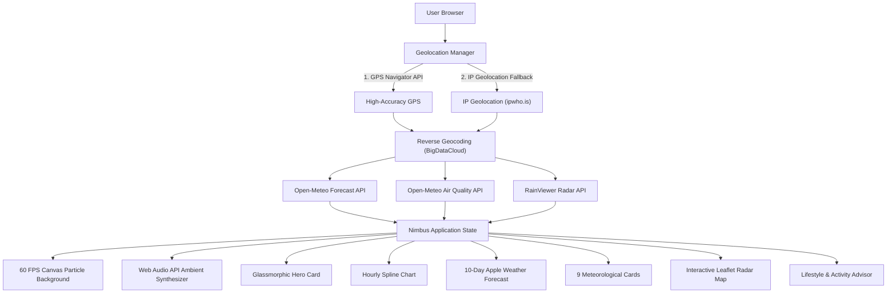

# 🌦️ Nimbus Weather — Next-Gen Live Weather Clone

> An ultra-modern, glassmorphic weather application with **live GPS auto-detection**, **dynamic 60 FPS weather particle canvas**, **real-time animated precipitation radar**, and **comprehensive meteorological analytics**.

---

## 🌟 Key Features

### 📍 1. Live Geolocation & Auto-Detection
- **High-Accuracy GPS**: Uses the HTML5 Geolocation API (`navigator.geolocation`) to pinpoint your exact coordinates.
- **Intelligent IP Fallback**: If browser geolocation permission is denied or pending, the app automatically determines your city and coordinates using IP-based reverse geocoding without user intervention.
- **Reverse Geocoding**: Converts raw coordinates into readable location names (*City, Region/State, Country*).
- **Global Search**: Instant autocomplete search for any city or town worldwide via Open-Meteo Geocoding.
- **Saved Favorites**: Pin your favorite cities (*London, Tokyo, New York, etc.*) to quick-access pills with persistent `localStorage`.

### 🎨 2. Dynamic 60 FPS Canvas Particle Background
- The background atmosphere morphs dynamically based on live weather conditions:
  - **Clear Day**: Warm solar glow with shimmering dust motes and sunbeams.
  - **Clear Night**: 180+ twinkling stars with sporadic shooting meteors.
  - **Rain & Drizzle**: Realistic angled raindrops with wind drift.
  - **Thunderstorm**: Heavy torrential rainfall with stochastic branched lightning flashes illuminating the sky.
  - **Snow**: Multi-layered fluttering snowflakes with sinusoidal physics.
  - **Overcast & Fog**: Billowing mist and soft horizontal drifting clouds.

### 🔊 3. Procedural Web Audio Ambient Sound Engine
- **Zero External Audio Files**: Uses the Web Audio API to synthesize ambient soundscapes in real-time.
- **Dynamic Weather Ambience**:
  - Soft gentle rain and droplet spatter
  - Resonant rolling thunder claps
  - Wind gusts modulated by low-frequency oscillators
  - Bird chirping for sunny days and crickets for clear nights
- **One-Click Audio Toggle**: Mute/Unmute toggle directly in the header.

### 📈 4. Interactive Hourly Forecast & Temperature Spline Chart
- **Next 24 to 48 Hours**: Smooth horizontal scrolling hourly cards showing conditions, temperature, rain chance, and wind.
- **Interactive Canvas Chart**: Smooth cubic Bezier spline graph.
- **Multi-Metric Toggles**: Switch between **Temperature curve**, **Precipitation probability bars**, and **Wind speed**.
- **Interactive Scrubbing**: Hover or drag across the chart to inspect precise hourly metrics.

### 📅 5. 10-Day Extended Forecast with Apple Weather-Style Range Bars
- Min & max temperature ranges visualized with dynamic gradient thermometer bars that display today's temperature marker relative to the full week.
- Precipitation probability badges.
- **Day Detail Modal**: Click on any day to open a deep-dive modal showing peak UV, max wind gusts, rain accumulation, and sunrise/sunset times.

### 🛰️ 6. Live Animated Precipitation Radar
- Powered by **Leaflet.js** and **RainViewer Global Weather Radar API**.
- Centers automatically on your live coordinates with an animated beacon marker.
- Interactive playback controls: **Play/Pause**, **timeline scrubbing slider**, **radar timestamp pill**, and **color intensity legend**.

### 🔬 7. Detailed Meteorological Analytics (3x3 Grid)
1. **Air Quality Index (AQI)**: US AQI score, health categorization, progress bar, and breakdown of **PM2.5, PM10, NO₂, and O₃**.
2. **UV Index**: Severity level, protective sunscreen/sunglasses guidance, and visual gauge meter.
3. **Wind & Gusts**: Animated compass dial with magnetic needle pointing to true wind direction, wind speed, and gusts.
4. **Sunrise & Sunset (Solar Arc)**: Real-time parameterized daylight arc displaying the sun's current position and remaining daylight countdown.
5. **Humidity & Dew Point**: Moisture percentage, calculated dew point, and human comfort evaluation.
6. **Precipitation Accumulation**: Measured 24-hour rainfall and rain chance.
7. **Visibility**: Distance clarity with haze/fog evaluations.
8. **Barometric Pressure**: Atmospheric pressure (hPa / inHg) and barometric trend.
9. **Moon Phase & Astronomy**: Real-time lunar phase calculation (Waxing Gibbous, Full Moon, etc.) with illumination percentage.

### 🏃 8. Lifestyle & Activity Advisors
- **Outdoor Running Score** (1-10 rating calculated from temperature, wind, humidity, and AQI).
- **Stargazing Quality** (calculated from cloud cover and moon illumination).
- **Car Wash Recommendation** (evaluated from 48-hour precipitation probability).
- **Attire & Umbrella Guide** (clothing suggestions and rain gear warnings).

### ⚙️ 9. Settings & Utilities
- **One-Click Unit Toggle**: Switch instantly between Metric (°C, km/h, mm, hPa) and Imperial (°F, mph, in, inHg).
- **Share Snapshot**: Copy a formatted weather report to your clipboard or trigger native mobile/desktop Web Share.
- **PWA Ready**: Includes `manifest.json` for desktop or mobile installation.

---

## 🏗️ Architecture & Data Flow



---

## 📁 Project Structure

```
WEATHER/
├── app.py                   # Python Flask web server with API proxies & static serving
├── run.py                   # Launcher script with auto port detection and browser launcher
├── run.bat                  # One-click Windows batch launcher
├── requirements.txt         # Dependencies (Flask>=3.0.0)
├── README.md                # Project documentation
└── static/
    ├── index.html           # Semantic HTML5 single-page application
    ├── favicon.svg          # Custom SVG weather favicon
    ├── manifest.json        # Progressive Web App manifest
    ├── css/
    │   ├── style.css        # Glassmorphic layout, typography & responsive CSS
    │   ├── animations.css   # Keyframe micro-animations & radar beacon pulses
    │   └── weather-themes.css # Dynamic condition-based color themes
    └── js/
        ├── app.js           # Main app controller, state management, UI rendering
        ├── geolocation.js   # Live GPS detection, IP fallback & reverse geocoding
        ├── weather-service.js # Open-Meteo weather & air quality API connector
        ├── weather-canvas.js# 60 FPS dynamic particle background engine
        ├── weather-charts.js# Interactive hourly spline curve & precipitation bars
        ├── weather-radar.js # Leaflet radar integration & RainViewer animation
        ├── audio-synth.js   # Zero-dependency procedural Web Audio ambient sound
        ├── icons.js         # Animated vector SVG weather icons
        └── utils.js         # Unit conversions, moon phase, WMO codes, lifestyle logic
```

---

## 🚀 How to Run the Project

### Method 1: One-Click Windows Launcher (Easiest)
Simply double-click:
```cmd
run.bat
```
This will automatically launch the Flask server and open the web app in your default browser.

---

### Method 2: Python Command Line
1. Open PowerShell or Command Prompt in the `WEATHER` folder.
2. (Optional) Install dependencies:
   ```cmd
   pip install -r requirements.txt
   ```
3. Run the launcher:
   ```cmd
   python run.py
   ```
4. The application will open automatically at:
   ```
   http://127.0.0.1:5000
   ```

---

### Method 3: Direct Static Opening
Because the JavaScript modules include direct public API fallbacks and offline mock generators, you can also open `static/index.html` directly in any modern web browser or serve it with any static web server:
```cmd
python -m http.server 8000 -d static
```

---

## 📡 APIs & Services Used
- **Open-Meteo Weather API**: Free, open-source global forecasting without API keys.
- **Open-Meteo Air Quality API**: European and US AQI with fine particulate tracking.
- **BigDataCloud Client Reverse Geocoding**: Localized city and subdivision resolution.
- **RainViewer Radar API**: Real-time precipitation satellite tile layers.
- **Leaflet.js**: Lightweight open-source interactive mapping.

---

## 📄 License
Created for academic, project, and portfolio demonstrations. MIT License.
